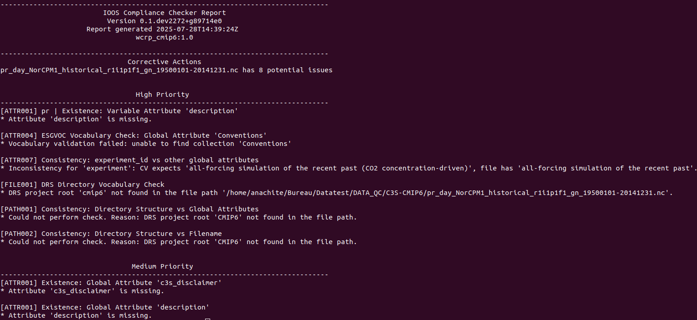

# Reporting

This page explains what you get in each output format

---

## 1. Text format (`-f text`)

- **Shows only problems by default** (FAIL/WARN). Passed checks are hidden.
- Ends with a short summary (e.g. `12 of 15 tests passed`).

**Example snippet (terminal):**


```html
<p align="center">
  
</p>
